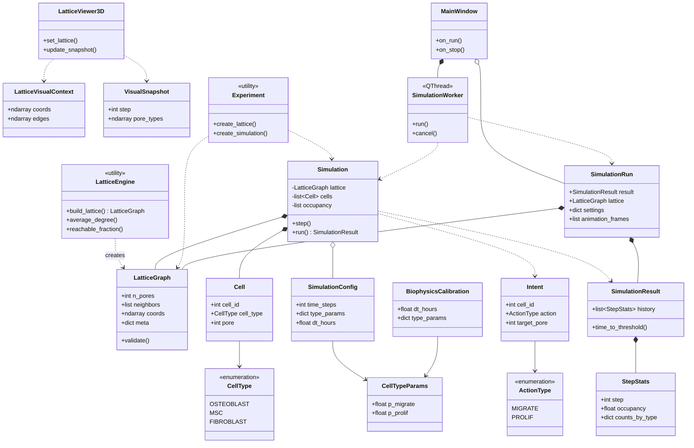
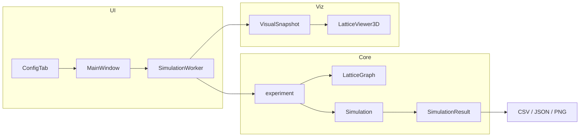
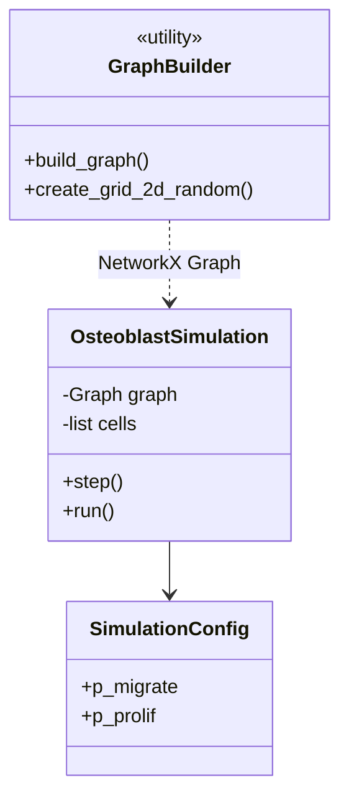

# UML: диаграмма классов (весь проект)

> **Для курсовой по логике симуляции клеток** используйте набор из **[uml/simulation/](uml/simulation/README.md)** — 12 диаграмм (use case, class, sequence, activity, state, component, object, communication) без GUI и сборки exe.

Основной продукт — **`bone_lattice_sim`** (3D, OpenPNM, PySide6).  
Legacy — **`osteoblast_sim`** (2D, NetworkX, Tkinter).

## Диаграмма реализации (для защиты)

UML-нотация (`+`/`-`, поля и методы). **Только предметная область** (решётка, клетки, симуляция, биофизика) — без UI, экспорта, 3D, CLI:

| Артефакт | Описание |
|----------|----------|
| [actual_classes.puml](actual_classes.puml) | Исходник PlantUML |
| [diagram_actual_classes.png](diagram_actual_classes.png) | PNG для слайдов |
| [diagram_actual_classes.svg](diagram_actual_classes.svg) | SVG для печати |
| [planning_classes.puml](planning_classes.puml) | Планирование (упрощённая) |

Пересборка: `python scripts/render_all_diagrams.py` (или `render_actual_diagram.py`).

**Параметризованные типы:** в `.puml` — `List~Cell~` (сырые `<` ломают PlantUML). Скрипт рендера заменяет `~` на `List<Cell>` в SVG и собирает PNG через `npx @resvg/resvg-js-cli`. Нужен Node.js. Команда: `python scripts/render_all_diagrams.py`.

## Как получить картинку (обзорная / legacy)

| Формат | Файл | Как рендерить |
|--------|------|----------------|
| PlantUML | [uml_classes.puml](uml_classes.puml) | обзор + legacy `osteoblast_sim` |
| Mermaid | ниже | GitHub, [mermaid.live](https://mermaid.live) |

Для отчёта: `\includegraphics{diagram_actual_classes.png}` из `docs/`.

---

## bone_lattice_sim (Mermaid)

---

## Поток данных (кратко)

---

## osteoblast_sim (legacy)

