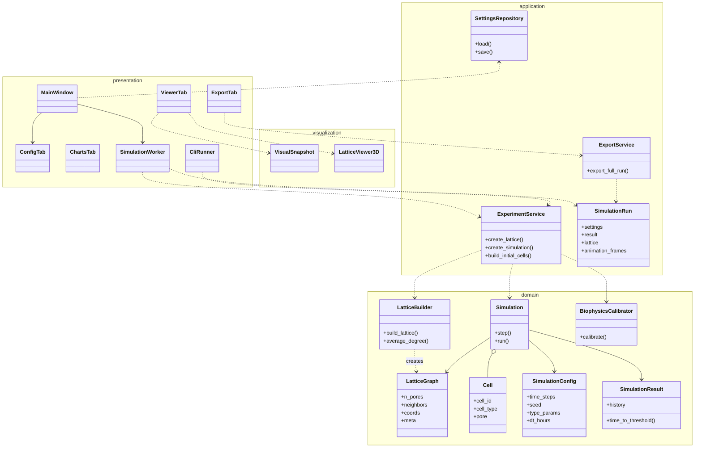

# Моделирование. Классы предметной области

**Назначение документа:** планирование структуры программы (этап «Подготовка к разработке»). Диаграмма **упрощённая** — отражает основные сущности и связи, без детализации GUI-виджетов и PyInstaller.

**Связь с вариантами использования:** в конце раздела — таблица UC → классы.

---

## 1. Принципы выделения классов

- Классы **не дублируют** таблицы СУБД (персистентность — файлы JSON/CSV).
- Выделены: **доменная модель** (решётка, клетки, симуляция), **сервисы приложения** (эксперимент, экспорт), **инфраструктура** (настройки, визуализация), **интерфейс** (окно, вкладки, фоновый worker).
- Диаграмма классов планирования согласована с реализацией `bone_lattice_sim`, но не включает legacy `osteoblast_sim`.

---

## 2. Диаграмма классов (упрощённая)

Файл PlantUML: [planning_classes.puml](planning_classes.puml)  
Рендер: VS Code PlantUML, [plantuml.com](https://www.plantuml.com/plantuml), или `java -jar plantuml.jar docs/planning_classes.puml`

---

## 3. Описание классов по слоям

### 3.1. Доменный слой (предметная область)

| Класс | Ответственность | Ключевые атрибуты / методы |
|-------|-----------------|----------------------------|
| **LatticeGraph** | Топология поровой сети | `neighbors`, `coords`, `meta` (preset, avg_degree) |
| **LatticeBuilder** | Построение сети OpenPNM, удаление throats, MST | `build_lattice(size, preset, deletion, seed)` |
| **Cell** | Агент-клетка в поре | `cell_type`, `pore` |
| **CellTypeParams** | Вероятности миграции/деления | `p_migrate`, `p_prolif` |
| **SimulationConfig** | Параметры прогона | `time_steps`, `seed`, `type_params`, `dt_hours` |
| **Simulation** | Синхронный шаг ABM, конфликты | `step()`, `run()`, `_resolve_conflicts()` |
| **SimulationResult** | История шагов, T50/T90 | `history: StepStats[]` |
| **BiophysicsCalibrator** | Расчёт dt и P из физических констант | `calibrate(pore_spacing_um)` |

### 3.2. Слой приложения

| Класс | Ответственность |
|-------|----------------|
| **ExperimentService** | Сборка решётки + начальных клеток + `Simulation` из словаря настроек |
| **SimulationRun** | Агрегат одного прогона (результат, решётка, настройки, кадры анимации) |
| **ExportService** | Запись CSV/JSON/VTK/PNG |
| **SettingsRepository** | Чтение/запись `bone_gui_settings.json` |

### 3.3. Презентационный слой

| Класс | Ответственность |
|-------|----------------|
| **MainWindow** | Координация вкладок, запуск/остановка worker |
| **ConfigTab** | Ввод параметров, валидация «Состав» |
| **ChartsTab** | Отображение кривых pyqtgraph |
| **ViewerTab** | 3D, анимация, предпросмотр |
| **ExportTab** | Кнопка экспорта, журнал путей |
| **SimulationWorker** | Поток выполнения `Simulation.run` |
| **CliRunner** | Разбор аргументов командной строки |

### 3.4. Визуализация

| Класс | Ответственность |
|-------|----------------|
| **VisualSnapshot** | Снимок занятости пор на шаге |
| **LatticeViewer3D** | Отрисовка PyVista (throats, glyph клеток) |

---

## 4. Связи между классами (текстом)

- **LatticeBuilder → LatticeGraph:** один ко многим не применимо; создаёт один граф на эксперимент.
- **Simulation → Cell:** композиция; список клеток изменяется при пролиферации.
- **Simulation → LatticeGraph:** использует `neighbors` для миграции.
- **ExperimentService** — фасад для UI/CLI: скрывает детали `build_lattice` и `parse_initial_cell_mix`.
- **SimulationWorker** — граница потоков: GUI не вызывает `Simulation` напрямую из UI-потока.
- **ExportService** принимает **SimulationRun**, не сырой `Simulation`.

---

## 5. Реализация UC классами

| UC | Основные классы |
|----|-----------------|
| UC-01 | `ConfigTab`, `SimulationWorker`, `ExperimentService`, `LatticeBuilder`, `Simulation`, `ChartsTab` |
| UC-02 | `ViewerTab`, `VisualSnapshot`, `ExperimentService.build_initial`, `Simulation` |
| UC-03 | `ExportTab`, `ExportService`, `SimulationRun` |
| UC-04 | `CliRunner`, `ExperimentService`, `ExportService` |
| UC-05 | `LatticeBuilder`, `ViewerTab`, `ExperimentService` |
| UC-06 | `BiophysicsCalibrator`, `SimulationConfig`, `ConfigTab` |
| UC-07 | `SimulationWorker`, `Simulation` (cancel_check) |
| UC-08 | `SettingsRepository`, `MainWindow` |

---

## 6. Отличие от «классов БД»

| Не является классом предметной области | Почему |
|----------------------------------------|--------|
| Таблица `pores` в SQL | Нет СУБД; поры — массив в `LatticeGraph` |
| Файл CSV | Артефакт экспорта, не доменная сущность |
| `QPushButton` | Деталь UI, не бизнес-логика |

---

## 7. Соответствие плану и коду (прототип)

На этапе планирования часть ролей оформлена как «сервисы»; в реализации они — модули и функции:

| План (диаграмма) | Реализация в `bone_lattice_sim` |
|------------------|----------------------------------|
| LatticeBuilder | `lattice/engine.py` — `build_lattice()`, `average_degree()` |
| ExperimentService | `experiment.py` — `create_lattice()`, `create_simulation()`, `build_initial_from_settings()` |
| ExportService | `io/export.py` — `export_full_run()` |
| SettingsRepository | `io/settings.py` — `load_settings()`, `save_settings()` |
| BiophysicsCalibrator | `simulation/biophysics.py` — `compute_biophysics_calibration()` → `BiophysicsCalibration` |
| CliRunner | `cli.py` — `main()`, `build_parser()` |
| SimulationRun | `io/run_bundle.py` — dataclass `SimulationRun`, `build_run_bundle()` |

---

*Детальная диаграмма реализованного кода: [uml_classes.md](uml_classes.md), [uml_classes.puml](uml_classes.puml).*

*Комплект по заданию «Подготовка к разработке»:* [Видение_проекта.md](Видение_проекта.md), [Варианты_использования.md](Варианты_использования.md), настоящий файл.
